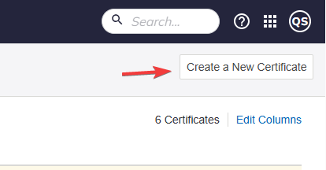
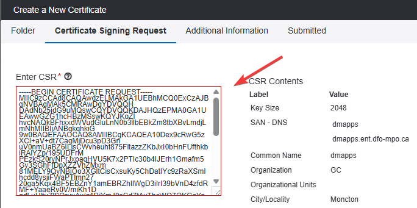
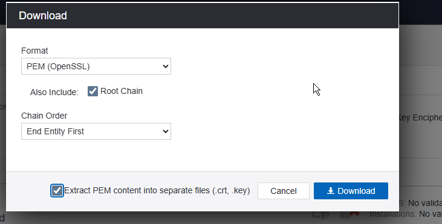

# SSL Certificates (Venafi)

2 step process:
 - Create the request and key(.csr, .key)
 - Create the certificate (.crt)
 


## Create the request and key:
Create a san.cnf and update the common name and DNS entries:

```text
[ req ]
default_bits = 2048
distinguished_name = req_distinguished_name
req_extensions = req_ext
prompt = no
[ req_distinguished_name ]
countryName = CA
stateOrProvinceName = NB
localityName = Moncton
organizationName = GC
commonName = SERVERNAME  <- EDIT ME
emailAddress = your.email@email.ca
[ req_ext ]
subjectAltName = @alt_names
[alt_names]
DNS.1 = hostname  <- EDIT ME
DNS.2 = hostname.ent.dfo-mpo.ca <- EDIT ME

```

The create the request using Openssl in powershell:

```
openssl req -out "myServer.csr" -newkey rsa:2048 -nodes -keyout "private.key" -config "san.cnf"
```

It is a good idea to specify the full paths so that you can easily find both of the output files: `private.key` and `myServer.csr`


## Create the .crt (venafi)
Once you have your .csr, you can submit it to venafi to create the certificate: 


Then you can copy paste the text from your csr into here and submit the request:


Once the request is approved, download the .crt:  


You now have the two ingredients you need for apache to set up ssl:  the `.crt` and the `private.key` files.  
Stick them on your server and add something like this to your `sites-available` file:

```apache
<VirtualHost *:443>
    SSLEngine on
    SSLCertificateFile "/etc/ssl/certs/myServer/myServer.crt"
    SSLCertificateKeyFile "/etc/ssl/certs/myServer/private.key"
    ...
```

Note:  the private key is associated with the request (.csr) file, so you can reuse both of these (.keyy & .csr) when renewing the certificates.

